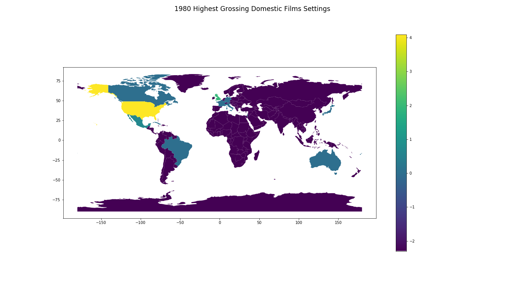
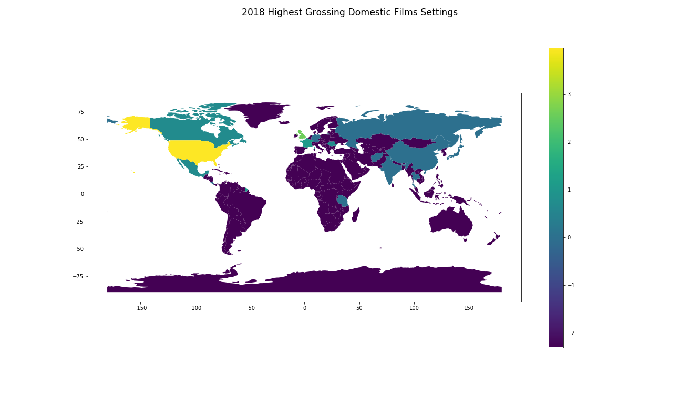

# Welcome!
I am a first year Masters student at USC studying Applied Data Science. I would like to use this website to showcase the skills and tools I have learned as well as display coding samples and projects. 

My resume can be found [here.](Emily Christiansen - Resume, Oct 2020.pdf)

## Film Settings by Year Project

**Question:** Over the years, how has the setting of popular films changed overtime, specifically in regard to global climates?
I have been taking the top 100 highest grossing *domestic* films by year since 1980 to 2018 and searching for the main setting of the film. Note: *not* where the movie was filmed but rather were the majority of the story takes place. If the setting was some place fictional, space based, or otherwise not able to be generalize to a single country or state, that film was disregarded. 

So far I have only completed the book end years of 1980 and 2018 as a proof of concept, their maps are shown below. 

